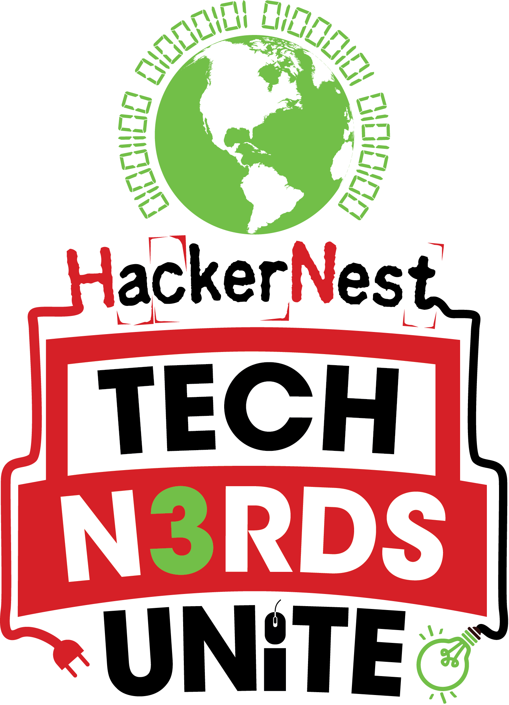

# The HackerNest Challenge

## About Us

HackerNest is a nonprofit organization and movement that builds local tech communities around the world. We believe they are the cornerstones of economic development: we want more people to get into tech so they can afford to live healthier and happier. Our down-to-earth Tech Socials and epic, socially beneficial hackathons encourage camaraderie, collaboration, innovation, mentorship, knowledge-sharing, and so much more.
Some more info about us: http://hackernest.com/about/

## The Challenge

Given our focus on building mentorship, knowledge-sharing, collaboration and FUN, we would like to challenge you to build something that will help others get in to coding. It could be a fun project (like building a robot), or it could be something that connects you to others who are looking for people to code with… Really it could be anything that ties in to encouraging people to code. The sky is the limit!

## Alternate Challenge

We partner with government bodies to help people get in to STEM fields and in particular, programming. Most recently we partnered with the UK and Canadian governments to do a hackathon for helping people with Dementia. We believe that the young people of today are even more inventive than us, so we would like to see you come up with someone that would help people in some way live a better life. 

You can use any language, system, or idea you want. 

We will provide raspberry pis with sensors to be used in the hackathon in case you need them, though they are not required to be used.

The Prize: 

## The Prize
A BBC micro:bit for each member of the winning team.

